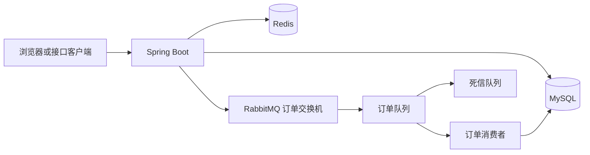

# 生活优选

面向本地生活服务场景的 Spring Boot 后端项目，提供用户认证、商户检索、内容互动、社交关系、签到统计和优惠券秒杀等能力。

本仓库的重点是将秒杀订单链路工程化：在 Redis 中完成库存与一人一单的原子预检，在 RabbitMQ 中异步削峰处理订单，并通过发布确认、失败补偿、消费重试、死信队列和数据库约束控制消息链路风险。

> 仓库仅包含后端源码与数据库脚本；前端静态资源及 Nginx 运行目录不在本仓库中。

## 项目亮点

| 方向 | 方案 | 解决的问题 |
|---|---|---|
| 缓存治理 | 空值缓存、互斥锁、逻辑过期 | 降低缓存穿透与热点失效时对数据库的冲击 |
| 秒杀预检 | Redis Lua 脚本 | 原子完成库存校验、重复下单校验和 Redis 库存预扣减 |
| 异步下单 | RabbitMQ + Spring AMQP | 请求线程快速返回，订单写库与库存扣减异步执行 |
| 消息可靠性 | Publisher Confirm、Return、重试、死信队列 | 区分明确发送失败与确认超时，保留异常消息排查入口 |
| 数据一致性 | 数据库事务、条件扣库存、唯一索引 | 强化最终落库阶段的一人一单与防超卖约束 |
| 登录态管理 | Redis Token、双层拦截器、ThreadLocal | 实现用户上下文加载、Token 续期与受保护接口校验 |

## 架构概览



## 秒杀订单链路

```text
请求秒杀接口
  -> Redis Lua：库存与一人一单原子校验，预扣 Redis 库存
  -> 生成全局订单 ID
  -> 发送 RabbitMQ 订单消息并等待发布确认
  -> 消费者事务落库：条件扣减 MySQL 库存 + 创建订单
  -> 失败消息重试，超过重试上限进入死信队列
```

### 关键取舍

- 对 RabbitMQ 明确拒收或不可路由的消息，执行 Lua 补偿，恢复 Redis 中的库存与购买资格。
- 对发布确认超时采用“未知状态”处理，而不是立刻回滚，避免消息实际已到达 Broker 时造成二次售卖风险。
- 消费端同时保留订单重复检查、条件扣减库存与数据库唯一索引，避免只依赖单一中间件保证业务正确性。

### RabbitMQ 拓扑

| 组件 | 名称 | 职责 |
|---|---|---|
| 订单交换机 | `hmdp.voucher.order.exchange` | 接收秒杀订单消息 |
| 订单队列 | `hmdp.voucher.order.queue` | 异步消费并创建订单 |
| 路由键 | `hmdp.voucher.order.create` | 订单消息定向路由 |
| 死信交换机 | `hmdp.voucher.order.dlx` | 接收超过重试上限的异常消息 |
| 死信队列 | `hmdp.voucher.order.dlq` | 保留异常订单，便于排查与后续补偿 |

## 功能范围

| 模块 | 对应能力 |
|---|---|
| 用户模块 | 验证码登录、用户信息、登录态续期、签到统计 |
| 商户模块 | 商户详情、分类查询、分页检索、名称搜索与缓存查询 |
| 内容模块 | 探店笔记、点赞、点赞列表与关注 Feed |
| 社交模块 | 关注/取关、共同关注 |
| 优惠券模块 | 优惠券管理、秒杀资格校验、异步订单创建 |

## 技术栈

| 分类 | 技术 |
|---|---|
| 基础框架 | Java 8、Spring Boot 2.3.12、Spring MVC |
| 数据访问 | MySQL 8、MyBatis-Plus 3.4.3 |
| 缓存与分布式能力 | Redis、Spring Data Redis、Lettuce |
| 消息队列 | RabbitMQ、Spring AMQP |
| 工具与构建 | Maven、Lombok、Hutool |

## 目录说明

```text
src/main/java/com/hmdp
|- config/          Web、MyBatis、RabbitMQ 等配置
|- controller/      REST 接口层
|- interceptor/     Token 刷新与登录校验
|- listener/        RabbitMQ 订单消费者
|- service/         核心业务实现
`- utils/           缓存、ID 生成与用户上下文工具

src/main/resources
|- db/hmdp.sql                  基础数据库脚本
|- db/rabbitmq-upgrade.sql      秒杀订单唯一索引升级脚本
|- seckill.lua                  秒杀原子预检脚本
|- seckill_rollback.lua         消息明确发送失败补偿脚本
`- application-local.example.yaml
```

## 快速启动

### 环境要求

- JDK 8
- MySQL 8.x
- Redis，默认端口 `6379`
- RabbitMQ，默认端口 `5672`

### 初始化

1. 创建 MySQL 数据库 `hmdp` 并执行 `src/main/resources/db/hmdp.sql`。
2. 对已有数据升级时，先检查重复订单，再执行 `src/main/resources/db/rabbitmq-upgrade.sql`。
3. 复制本地配置模板并填写 MySQL 密码：

```powershell
Copy-Item src/main/resources/application-local.example.yaml src/main/resources/application-local.yaml
```

`application-local.yaml` 已被 Git 忽略；公开仓库不包含本机数据库密码或压测 Token。

4. 启动 MySQL、Redis 与 RabbitMQ。
5. 在 IDEA 中运行 `com.hmdp.HmDianPingApplication`，服务默认监听 `http://localhost:8081`。
6. 使用 `GET /shop-type/list` 验证基础接口链路。

## 验证与边界

- 已使用 JDK 8 运行 `mvn -o -DskipTests package` 完成离线打包验证。
- 该构建验证不替代 Redis、MySQL、RabbitMQ 联调，也不替代秒杀链路端到端测试。
- 当前仓库没有正式压测报告，因此不声明 QPS、P95、P99 或最大并发等性能数字。
- 后续压测应记录机器配置、并发阶梯、吞吐量、延迟分位数、错误率、MQ 峰值积压、订单数、库存和重复订单数。

## 来源

本项目基于 [KNeegcyao/dianping](https://github.com/KNeegcyao/dianping) 学习项目继续开发；本仓库维护 RabbitMQ 秒杀链路、配置安全化和相关工程改造。使用或再发布前请核验上游与第三方资源的授权条件。
