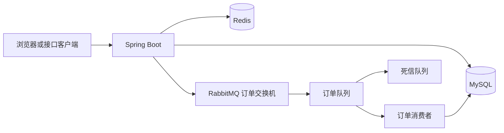

# 生活优选

面向本地生活服务场景的 Spring Boot 后端项目，提供用户认证、商户检索、内容互动、社交关系、签到统计和优惠券秒杀等能力。

本仓库的重点是将秒杀订单链路工程化：在 Redis 中完成库存与一人一单的原子预检，在 RabbitMQ 中异步削峰处理订单，并通过发布确认、失败补偿、消费重试、死信队列和数据库约束控制消息链路风险。新增订单追踪、超时对账、死信归档和人工受控修复，使 Redis 预扣、MQ 消息与 MySQL 落库可以被定位和核验。

> 仓库仅包含后端源码与数据库脚本；前端静态资源及 Nginx 运行目录不在本仓库中。

## 项目亮点

| 方向 | 方案 | 解决的问题 |
|---|---|---|
| 缓存治理 | 空值缓存、互斥锁、逻辑过期 | 降低缓存穿透与热点失效时对数据库的冲击 |
| 秒杀预检 | Redis Lua 脚本 | 原子完成库存校验、重复下单校验和 Redis 库存预扣减 |
| 异步下单 | RabbitMQ + Spring AMQP | 请求线程快速返回，订单写库与库存扣减异步执行 |
| 消息可靠性 | Publisher Confirm、Return、重试、死信队列 | 区分明确发送失败与确认超时，保留异常消息排查入口 |
| 数据一致性 | 数据库事务、条件扣库存、唯一索引 | 强化最终落库阶段的一人一单与防超卖约束 |
| 订单可靠性闭环 | Redis 预扣追踪、MySQL 处理记录、超时对账、受控重放/回补 | 定位消息重复、消费者异常、数据库失败和库存不一致 |
| 登录态管理 | Redis Token、双层拦截器、ThreadLocal | 实现用户上下文加载、Token 续期与受保护接口校验 |

## 架构概览



## 秒杀订单链路

```text
请求秒杀接口
  -> Redis Lua：库存与一人一单原子校验，预扣 Redis 库存并写入订单追踪
  -> 生成全局订单 ID
  -> 发送 RabbitMQ 订单消息并记录 CONFIRMED/FAILED/UNKNOWN
  -> 消费者事务落库：锁定处理记录，条件扣减 MySQL 库存 + 创建订单
  -> 事务提交后标记 PERSISTED，清理 Redis 待检查索引
  -> 失败消息重试，超过重试上限进入死信队列并归档
```

### 关键取舍

- 对 RabbitMQ 明确拒收或不可路由的消息，执行 Lua 补偿，恢复 Redis 中的库存与购买资格。
- 对发布确认超时采用“未知状态”处理，而不是立刻回滚，避免消息实际已到达 Broker 时造成二次售卖风险。
- 消费端同时保留订单重复检查、条件扣减库存与数据库唯一索引，避免只依赖单一中间件保证业务正确性。
- 对超过阈值仍未落库的预扣订单只标记 `MANUAL_REVIEW`，不自动取消未知订单；管理员可用唯一 `requestId` 触发重放或回补，操作结果写入审计表。
- MySQL 订单与处理记录是落库后的事实来源，Redis 追踪键用于快速定位预扣；对账任务优先发现两者不一致，Redis 回补失败会保留 `CANCEL_PENDING_REFUND` 状态。

### RabbitMQ 拓扑

| 组件 | 名称 | 职责 |
|---|---|---|
| 订单交换机 | `hmdp.voucher.order.exchange` | 接收秒杀订单消息 |
| 订单队列 | `hmdp.voucher.order.queue` | 异步消费并创建订单 |
| 路由键 | `voucher.order.created` | 订单消息定向路由 |
| 死信交换机 | `hmdp.voucher.order.dlx` | 接收超过重试上限的异常消息 |
| 死信队列 | `hmdp.voucher.order.dlq` | 保留异常订单，便于排查与后续补偿 |

## 功能范围

| 模块 | 对应能力 |
|---|---|
| 用户模块 | 验证码登录、用户信息、登录态续期、签到统计 |
| 商户模块 | 商户详情、分类查询、分页检索、名称搜索与缓存查询 |
| 内容模块 | 探店笔记、点赞、点赞列表与关注 Feed |
| 社交模块 | 关注/取关、共同关注 |
| 优惠券模块 | 优惠券管理、秒杀资格校验、异步订单创建、订单状态查询与可靠性处理 |

## 技术栈

| 分类 | 技术 |
|---|---|
| 基础框架 | Java 8、Spring Boot 2.3.12、Spring MVC |
| 数据访问 | MySQL 8、MyBatis-Plus 3.4.3 |
| 缓存与分布式能力 | Redis、Spring Data Redis、Lettuce |
| 消息队列 | RabbitMQ、Spring AMQP |
| 工具与构建 | Maven、Lombok、Hutool |

## 目录说明

```text
src/main/java/com/hmdp
|- config/          Web、MyBatis、RabbitMQ 等配置
|- controller/      REST 接口层
|- interceptor/     Token 刷新与登录校验
|- listener/        RabbitMQ 订单消费者
|- service/         核心业务实现
`- utils/           缓存、ID 生成与用户上下文工具

src/main/resources
|- db/hmdp.sql                  基础数据库脚本
|- db/rabbitmq-upgrade.sql      秒杀订单唯一索引升级脚本
|- db/order-reliability-upgrade.sql 订单处理、修复审计和死信归档表
|- seckill.lua                  秒杀原子预检脚本
|- seckill_rollback.lua         消息明确发送失败补偿脚本
`- application-local.example.yaml
```

## 快速启动

### 环境要求

- JDK 8
- MySQL 8.x
- Redis，默认端口 `6379`
- RabbitMQ，默认端口 `5672`

### 初始化

1. 创建 MySQL 数据库 `hmdp` 并执行 `src/main/resources/db/hmdp.sql`。
2. 对已有数据升级时，先检查重复订单，再执行 `src/main/resources/db/rabbitmq-upgrade.sql`。
3. 执行 `src/main/resources/db/order-reliability-upgrade.sql`，创建可靠性追踪表；未执行此迁移前不要打开对账任务。
4. 复制本地配置模板并填写 MySQL 密码：

```powershell
Copy-Item src/main/resources/application-local.example.yaml src/main/resources/application-local.yaml
```

`application-local.yaml` 已被 Git 忽略；公开仓库不包含本机数据库密码或压测 Token。

5. 启动 MySQL、Redis 与 RabbitMQ。
6. 在 IDEA 中运行 `com.hmdp.HmDianPingApplication`，服务默认监听 `http://localhost:8081`。
7. 使用 `GET /shop-type/list` 验证基础接口链路。

### 可靠性接口

- `GET /voucher-order/{orderId}/status`：只允许订单所属用户查询，返回发布状态和处理状态。
- `GET /admin/order-reliability/anomalies`：查看 `MANUAL_REVIEW` 和 `CANCEL_PENDING_REFUND` 记录。
- `POST /admin/order-reliability/reconcile`：手动触发一批对账。
- `POST /admin/order-reliability/{orderId}/replay`：不重新预扣库存，重新投递原订单消息。
- `POST /admin/order-reliability/{orderId}/refund`：先写 MySQL 取消标记，再用原订单号回补 Redis。

管理员接口默认关闭。启用前设置 `ORDER_RELIABILITY_ADMIN_ENABLED=true`，并用 `ORDER_RELIABILITY_ADMIN_USER_IDS` 配置用户 ID 白名单，例如 `1,2`。重放和回补请求体必须包含唯一 `requestId` 与人工处理 `reason`。

## 验证与边界

- 已使用 JDK 8 运行 `mvn -o -DskipTests package` 完成离线打包验证。
- 可靠性单测覆盖状态转换、重复恢复请求、迟到消息、数据库库存失败和发布结果分类；Redis 生命周期测试已在本机 `127.0.0.1:6379` 验证预扣留痕与幂等回补。
- 该构建验证不替代 Redis、MySQL、RabbitMQ 联调，也不替代秒杀链路端到端测试。
## 压测报告

本轮为本机单实例、专用优惠券数据上的库存边界测试，报告同时保留 JMeter 原始采样和异步订单最终核验结果。它用于复现和面试说明，不代表生产环境容量。

| 指标 | 结果 |
| --- | --- |
| 测试对象 | `voucher_id=22`，初始库存 100 |
| 测试用户 | 1000 个独立用户，每人请求 1 次 |
| 升压策略 | 30 秒升压窗口 |
| JMeter 总采样数 | 1000 |
| HTTP 200 | 1000 |
| 业务成功 | 100 |
| 库存不足 | 900 |
| 全部请求平均耗时 | 598.76 ms |
| 全部请求 P95 / P99 | 4291.95 ms / 5238.78 ms |
| 全部请求吞吐量 | 34.7379 req/s |

900 次断言失败对应库存不足的业务结果，不是 HTTP 服务异常；接口 HTTP 状态仍为 200。异步处理完成后，MySQL 最终订单数为 100，Redis 与 MySQL 剩余库存均为 0，重复订单数为 0，RabbitMQ 主队列未确认消息和死信消息均为 0。

详细执行步骤、SQL 核验口径和全部证据文件见 [`docs/load-test/README.md`](docs/load-test/README.md)：

- [JMeter 脚本](docs/load-test/reports/seckill-v22-1000-boundary/seckill-v22-1000.jmx)
- [原始 JTL](docs/load-test/reports/seckill-v22-1000-boundary/seckill.jtl)
- [HTML 报告](docs/load-test/reports/seckill-v22-1000-boundary/html-report/index.html)
- [SQL 核验结果](docs/load-test/reports/seckill-v22-1000-boundary/sql-verification.txt)
- [运行汇总](docs/load-test/reports/seckill-v22-1000-boundary/run-summary.json)

## 验证与边界

- 已使用 JDK 8 运行 `mvn -o -DskipTests package` 完成离线打包验证。
- 可靠性单测覆盖状态转换、重复恢复请求、迟到消息、数据库库存失败和发布结果分类；Redis 生命周期测试已在本机 `127.0.0.1:6379` 验证预扣留痕与幂等回补。
- 该构建验证不替代 Redis、MySQL、RabbitMQ 联调，也不替代秒杀链路端到端测试。
- 本轮压测数据仅适用于记录中的本机单实例和测试数据；简历或面试中应同时说明测试条件、JTL、HTML 报告和 SQL 核验结果。

## 来源

本项目基于 [KNeegcyao/dianping](https://github.com/KNeegcyao/dianping) 学习项目继续开发；本仓库维护 RabbitMQ 秒杀链路、配置安全化和相关工程改造。使用或再发布前请核验上游与第三方资源的授权条件。
