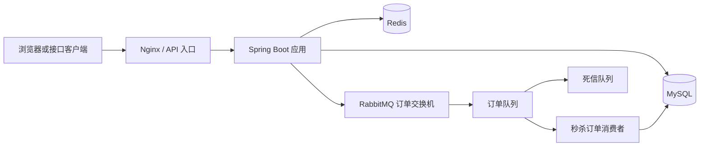

# 生活优选 Life Selection

一个面向本地生活服务场景的 Spring Boot 后端项目，覆盖用户登录、商户查询、缓存治理、探店内容、社交关注、签到统计和优惠券秒杀等业务。

本仓库重点完成了秒杀链路的工程化改造：使用 Redis Lua 原子预检库存和购买资格，通过 RabbitMQ 异步处理订单，并补充发布确认、失败补偿、消费重试、死信队列和数据库唯一约束。

> 当前仓库只包含后端源码和数据库脚本。前端静态资源与 Nginx 运行目录不在本仓库中。

## 核心架构



## 功能模块

| 模块 | 主要能力 | 关键实现 |
|---|---|---|
| 用户认证 | 验证码登录、用户信息、会话刷新 | Redis Token、双层拦截器、ThreadLocal |
| 商户服务 | 商户详情、分类、分页与名称查询 | MyBatis-Plus、Redis 缓存 |
| 缓存治理 | 缓存穿透、缓存击穿、逻辑过期 | 空值缓存、互斥锁、逻辑过期 |
| 内容互动 | 探店笔记、点赞、关注与共同关注 | Redis ZSet、Set、Feed 流 |
| 用户签到 | 签到记录与连续签到统计 | Redis Bitmap |
| 优惠券秒杀 | 资格校验、异步下单、一人一单 | Redis Lua、RabbitMQ、数据库事务与唯一索引 |

## 秒杀处理链路

1. `RedisIdWorker` 生成全局订单 ID。
2. `seckill.lua` 在 Redis 中原子校验库存与一人一单资格，并预扣 Redis 库存。
3. 应用将订单消息发送到 RabbitMQ，等待 Publisher Confirm，并检查 Return 回退消息。
4. 明确发送失败时执行 `seckill_rollback.lua`，恢复 Redis 库存与用户购买资格。
5. 发送确认超时时按“未知状态”处理，避免消息其实已到达时错误回滚造成超卖。
6. 消费者在事务中检查重复订单、条件扣减 MySQL 库存并保存订单。
7. 消费异常由 Spring AMQP 按配置重试；超过次数后进入死信队列。

### RabbitMQ 拓扑

| 组件 | 名称 | 用途 |
|---|---|---|
| 订单交换机 | `hmdp.voucher.order.exchange` | 接收秒杀订单消息 |
| 订单队列 | `hmdp.voucher.order.queue` | 消费者异步创建订单 |
| 路由键 | `hmdp.voucher.order.create` | 订单消息路由 |
| 死信交换机 | `hmdp.voucher.order.dlx` | 接收处理失败的消息 |
| 死信队列 | `hmdp.voucher.order.dlq` | 保留异常订单供人工排查 |

## 项目结构

```text
src/main/java/com/hmdp
├─ config/          Spring、Redis、RabbitMQ 与 MVC 配置
├─ controller/      用户、商户、博客、关注、优惠券接口
├─ dto/             接口请求与响应对象
├─ entity/          数据库实体
├─ interceptor/     Token 刷新与登录校验
├─ listener/        RabbitMQ 秒杀订单消费者
├─ mapper/          MyBatis-Plus 数据访问层
├─ service/         业务接口与实现
└─ utils/           缓存、ID、Redis 锁和用户上下文工具

src/main/resources
├─ db/hmdp.sql                  基础数据库脚本
├─ db/rabbitmq-upgrade.sql      秒杀订单唯一索引升级脚本
├─ application.yaml             可公开的环境变量配置
├─ application-local.example.yaml
├─ seckill.lua                  秒杀资格原子校验脚本
└─ seckill_rollback.lua         MQ 明确发送失败补偿脚本
```

## 技术栈

| 分类 | 技术 |
|---|---|
| 基础框架 | Java 8、Spring Boot 2.3.12 |
| Web | Spring MVC、Tomcat |
| 数据访问 | MyBatis-Plus 3.4.3、MySQL Connector 8.0.28 |
| 缓存 | Redis、Spring Data Redis、Lettuce |
| 消息队列 | RabbitMQ、Spring AMQP |
| 工具 | Hutool 5.7.17、Lombok、Maven |

## 本地运行

### 1. 环境要求

- JDK 8
- MySQL 8.x
- Redis，默认端口 `6379`
- RabbitMQ，默认 AMQP 端口 `5672`
- Maven 或 IDEA 内置 Maven

### 2. 初始化数据库

1. 创建数据库 `hmdp`。
2. 执行 `src/main/resources/db/hmdp.sql`。
3. 对已有数据库升级前先检查重复订单，再执行 `src/main/resources/db/rabbitmq-upgrade.sql`。

### 3. 创建本地配置

将示例文件复制为本地配置：

```powershell
Copy-Item src/main/resources/application-local.example.yaml src/main/resources/application-local.yaml
```

填写本机 MySQL 密码。`application-local.yaml` 已被 Git 忽略，不会上传到公开仓库。其他配置可以通过环境变量覆盖：

| 环境变量 | 默认值或作用 |
|---|---|
| `SERVER_PORT` | `8081` |
| `MYSQL_URL` | 本机 `hmdp` 数据库连接 |
| `MYSQL_USERNAME` | `root` |
| `MYSQL_PASSWORD` | 无公开默认值 |
| `REDIS_HOST` / `REDIS_PORT` | `127.0.0.1` / `6379` |
| `RABBITMQ_HOST` / `RABBITMQ_PORT` | `localhost` / `5672` |
| `RABBITMQ_USERNAME` / `RABBITMQ_PASSWORD` | 本地开发默认 `guest` / `guest` |

### 4. 启动服务

1. 启动 MySQL、Redis 和 RabbitMQ。
2. 在 IDEA 中运行 `com.hmdp.HmDianPingApplication`。
3. 后端默认监听 `http://localhost:8081`。
4. 可使用 `GET /shop-type/list` 检查基础数据库与接口链路。

## 当前实现结果

- 已实现用户、商户、内容互动、关注、签到和优惠券秒杀等后端模块。
- 已将秒杀订单从同步/Redis Stream 思路调整为 RabbitMQ 异步处理链路。
- 已增加 MQ 发布确认、不可路由检查、明确失败回滚、消费重试和死信队列。
- 已通过数据库唯一索引与消费端重复检查加强“一人一单”约束。
- 已将本机数据库密码和压测 Token 排除在公开版本之外。
- 已使用 JDK 8 完成 `mvn -o -DskipTests package` 离线打包验证；该结果不包含依赖中间件的集成测试。
- 当前没有提交可复核的正式压测报告，因此不声明 QPS、P95 或并发上限；后续应使用 JMeter 阶梯压测补充真实数据。

## 验证建议

发布性能数字前至少记录：测试机器配置、并发用户数、持续时间、吞吐量、P95/P99 延迟、HTTP 错误率、业务拒绝率、MQ 峰值积压、最终订单数、剩余库存和重复订单数。

## 来源说明

本项目是在 [KNeegcyao/dianping](https://github.com/KNeegcyao/dianping) 学习项目基础上的二次开发版本。仓库中的 RabbitMQ 秒杀链路、配置安全化和相关工程改造由本仓库维护者继续完成。使用、展示或再发布时请同时核验上游项目与第三方资源的授权条件。
